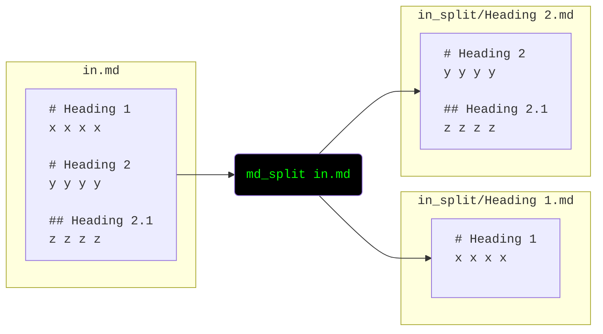

# md-split

## For Users

**Installation**

Either use pip:

    pip install md-split
    md_split

Or simply download [md_split.py](md_split.py) and run it:

    python3 md_split.py

## For Developers

Run tests

    poetry run pytest

[Download statistics](https://pypistats.org/packages/md-split)