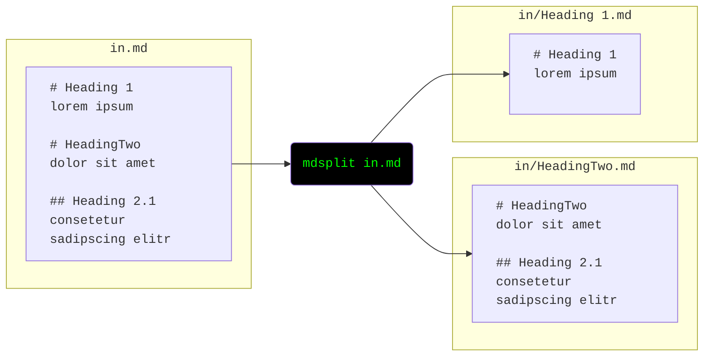
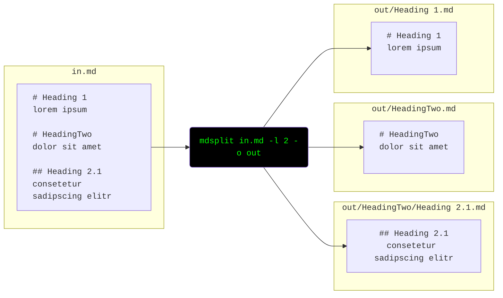

# mdsplit

`mdsplit` is a python command line tool to
**split markdown files** into chapters
**at a given [heading level](https://spec.commonmark.org/0.30/#atx-headings)**.

Each chapter (or subchapter) is written to its own file,
which is named after the heading title.
These files are written to subdirectories representing the document's structure.
Optionally a table of contents (`toc.md`) can be created for each input file.

**Note:**
- *Code blocks* (`` ``` ``)are detected (and headers inside ignored)
- The output is *guaranteed to be identical* with the input
  (except for the separation into multiple files of course)
    - This means: no touching of whitespace or changing `-` to `*` of your lists
      like some viusual markdown editors tend to do
- Text before the first heading is written to a file with the same name as the markdown file
- Chapters with the same heading name are written to the same file.
- Reading from `stdin` is supported
- Can easily handle large files,
  e.g. a 1 GB file is split into 30k files in 35 seconds on my 2015 Thinkpad (with an SSD)

**Limitations:**
- Only [ATX headings](https://spec.commonmark.org/0.30/#atx-headings) 
  such as `# Heading 1` are supported.
  [Setext headings](https://spec.commonmark.org/0.30/#setext-headings)
  (underlined headings) are not recognised.

**Similar projects:**

You may also be interested in https://github.com/alandefreitas/mdsplit (C++-based).

## Installation

Either use pip:

    pip install mdsplit
    mdsplit

Or simply download [mdsplit.py](mdsplit.py) and run it (it does not use any dependencies but python itself):

    python3 mdsplit.py

## Usage

**Show documentation and supported arguments**:

```bash
mdsplit --help
```

```
usage: mdsplit.py [-h] [-e ENCODING] [-l {1,2,3,4,5,6}] [-t] [-o OUTPUT] [-f] [-v] [input]

positional arguments:
  input                 path to input file/folder (omit or set to '-' to read from stdin)

options:
  -h, --help            show this help message and exit
  -e ENCODING, --encoding ENCODING
                        force a specific encoding, default: python's default platform encoding
  -l {1,2,3,4,5,6}, --max-level {1,2,3,4,5,6}
                        maximum heading level to split, default: 1
  -t, --table-of-contents
                        Generate a table of contents (one 'toc.md' per input file)
  -o OUTPUT, --output OUTPUT
                        path to output folder (must not exist)
  -f, --force           write into output folder even if it already exists
  -v, --verbose
```

**Split a file at level 1 headings**, e.g. `# This Heading`, and write results to an output folder based on the input name:

```bash
mdsplit in.md
```



**Split a file at level 2 headings** and higher, e.g. `# This Heading` and `## That Heading`, and write to a specific output directory:

```bash
mdsplit in.md --max-level 2 --output out
```



**Split markdown from stdin**:

```bash
cat in.md | mdsplit --output out
```

## Development (Ubuntu 22.04)

Add the [deadsnakes PPA](https://launchpad.net/~deadsnakes/+archive/ubuntu/ppa)
and install additional python versions for testing

```bash
sudo add-apt-repository ppa:deadsnakes/ppa
sudo apt install python3.7 python3.7-distutils
...
```

Install [poetry](https://python-poetry.org)

Prepare virtual environment and download dependencies

    poetry install

Run tests (for the default python version)

    poetry run pytest

Run tests for all supported python versions

    poetry run tox

Release new version

    poetry build
    poetry publish

[Download statistics](https://pypistats.org/packages/mdsplit)
