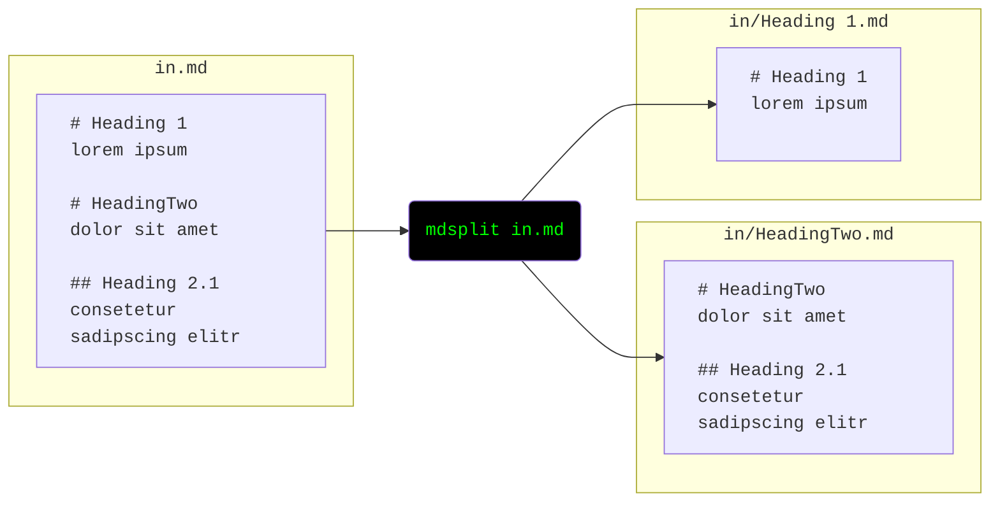
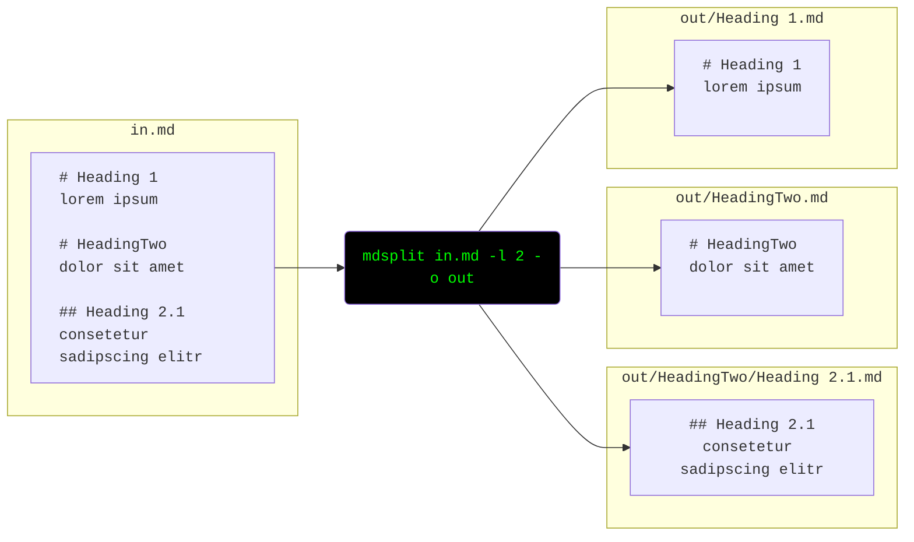

# mdsplit

`mdsplit` is a python command line tool to
**split markdown files** into chapters
at (a user-defined) heading level.

Each chapter (or subchapter) is written to its own file.
These files are written to subdirectories representing the document's structure.

Note:
- The output is *guaranteed to be identical* with the input (except for the separation into multiple files of course).
    - This means: no touching of whitespace or changing `-` to `*` of your lists like some viusual markdown editors tend to do
- Text before the first heading is written to a file with the same name as the markdown file.
- Chapters with the same heading name are written to the same file.

## Installation

Either use pip:

    pip install mdsplit
    mdsplit

Or simply download [mdsplit.py](mdsplit.py) and run it:

    python3 mdsplit.py
## Usage

**Split by heading 1** and write to an output folder based on the input name 

```bash
mdsplit in.md
```



**Split by heading 2**

```bash
mdsplit in.md --max-level 2 --output out
```



## Development

Run tests

    poetry run pytest

[Download statistics](https://pypistats.org/packages/mdsplit)